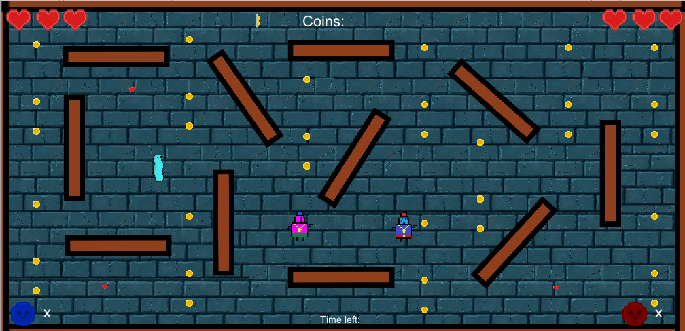

# Gun Repair
## Game submitted to the Global Game Jam 2020
This is a 2D top-down view multiplayer game made for the Global Game Jam which was held January 31 - February 2, 2020 in Birmingham, United Kingdom.
The theme was "Repair" which inspired the plot of the game where two players have to rebuild a gun with randomly dropped pieces on the map and at the end to use it against the patrooling creature.
Made in Unity.

## Gameplay:

## How to play it?
To download and install the game go [there](..master/Builds), choose your preffered operating system and download the available archive file.
